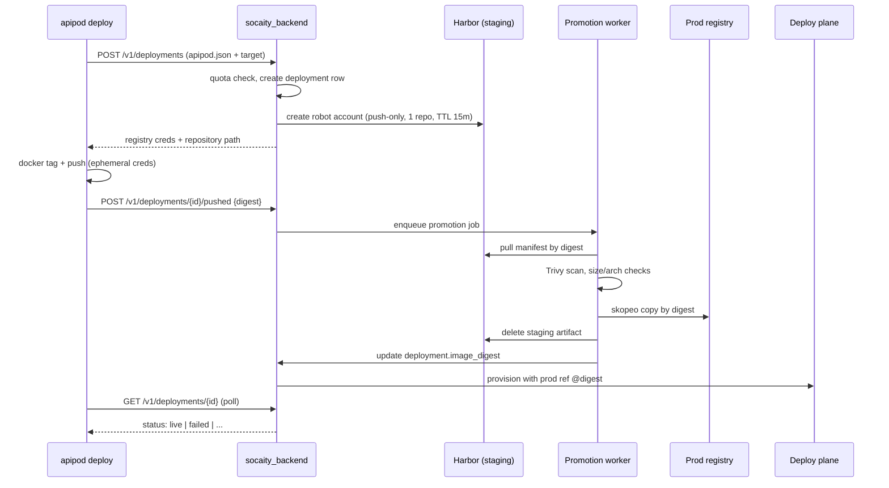

# APIPod Deploy pipeline: Architecture Plan

## Executive summary

APIPod today stops at **draft creation**: `apipod deploy` calls `v1/deployment/analyze` and `v1/deployment/draft`, then tells the user to build locally and finish in the dashboard. There is no image upload, no digest binding, and no automated promotion to the deploy plane.

The missing piece is a **secure, least-privilege image handshake**: authenticated users push exactly one image to exactly one staging repository for a short window; the platform validates, promotes by digest, and only then provisions.

**Recommendation:** Harbor as the staging registry (batteries included: RBAC, robot accounts, Trivy, webhooks, GC, S3 backend). Scaleway Container Registry (SCR) or a second Harbor project as production pull-only storage. Ephemeral Harbor robot accounts per deployment attempt, scoped push-only to `staging/{user_id}/{deployment_id}`.

This fits the existing async job/polling model in `socaity_backend` and the roadmap item in APIPod README: *"One-command deploy execution (container push + provisioning) on top of the draft flow."*

---

## Problem statement

| Actor | Must be able to | Must NOT be able to |
|-------|-----------------|---------------------|
| User (CLI) | Push one image for one deployment | List catalog, browse other tenants, pull prod images, delete arbitrary repos, obtain long-lived creds |
| Platform (backend) | Issue scoped creds, validate, promote, deploy, audit | — |
| Deploy plane (RunPod/K8s) | Pull prod images by digest | Push anything |

This is the classic **"docker push as an untrusted-user API"** problem. The solution is not "give users a registry account" — it is **credential brokering with digest-locked promotion**.

---

## Current state (codebase baseline)

```
apipod scan → apipod build (local docker build, tag apipod-{title})
           → apipod analyze  → POST v1/deployment/analyze
           → apipod deploy   → POST v1/deployment/draft
           → [GAP: push image]
           → [GAP: confirm digest]
           → dashboard manual finish
           → backend async deploy (health job → OpenAPI job → live)
```

**Existing assets to reuse:**

| Component | Location | Reuse for |
|-----------|----------|-----------|
| CLI auth | `socaity_cli.credentials`, `SocaityBackendClient` | Bearer token on all handshake calls |
| Deploy helpers | `socaity_cli/deployment.py` | Extend with push + poll phases |
| Docker build | `DeploymentManager.build_docker_image()` | Pre-push local build |
| Async deploy jobs | `poll_async_deployment`, `DeploymentTracker` | Same pattern for image pipeline states |
| Storage quota | `FileUploadHandler`, `UserStorageUsage` | Parallel `registry_storage_bytes` quota |
| Scaleway S3 | `common/storage/storage_handler.py` | Harbor blob backend (same provider) |

**Explicit gap:** `SocaityBackendClient` has no `begin_push`, `confirm_push`, or `poll_deployment` methods; backend has no registry integration.

---

## Architecture

### High-level flow



### Two-tier registry model

Use **one Harbor instance, two projects** (not two separate registries) for v1:

| Tier | Harbor project | Who writes | Who reads | Lifetime |
|------|----------------|------------|-----------|----------|
| **Staging** | `staging` | User robot (push-only, single repo) | Promotion worker (pull) | Minutes–hours; deleted after promotion or TTL |
| **Production** | `prod` | Promotion worker only | Deploy plane (pull-only robot) | Until service decommissioned |

**Repository naming (immutable, no user-chosen names):**

```
registry.socaity.ai/staging/{user_id}/{deployment_id}
registry.socaity.ai/prod/{user_id}/{service_id}@{digest}
```

Tags are convenience only (`:latest`, `:v3`). **All deploy references use digest.** This eliminates TOCTOU (user re-pushing a different image under the same tag after scan).

**Why not two physical registries?** Harbor projects + RBAC already isolate tenants. A second registry (e.g. SCR for prod) adds operational value later (cheaper prod egress, simpler deploy-plane IAM) but is not required for v1 security.

### Why Harbor (vs Distribution/Zot + custom token server)

| Capability | Harbor | Plain Distribution | Zot |
|------------|--------|-------------------|-----|
| Per-repo robot accounts | ✅ native | ❌ manual | ⚠️ limited |
| Push-only RBAC | ✅ | ❌ | ⚠️ |
| Built-in Trivy scanning | ✅ | ❌ | ❌ |
| Webhooks on push | ✅ | ❌ | ⚠️ |
| S3-compatible backend | ✅ | ✅ | ✅ |
| UI / audit log | ✅ | ❌ | minimal |
| Operational cost | medium | low | low |

Harbor is the right **v1 choice**: it ships the security and ops features you'd otherwise build. Revisit a lean Distribution + token server path only if Harbor operational cost becomes painful at scale.

**Blob storage:** Harbor configured with Scaleway Object Storage (same region as K8s — EU sovereignty). Enables cross-repo blob mount on promotion (no re-upload of shared layers).

---

## Security model

### Credential issuance (ephemeral robot account)

On `POST /v1/deployments/{id}/push_credentials`:

1. Backend verifies: user owns deployment, status = `awaiting_image`, quota OK.
2. Creates Harbor robot account: `deploy-{deployment_id}-{random}`.
3. Permissions: **push + pull on exactly one repository** in project `staging`; no project-level list, no catalog, no delete on other repos.
4. TTL: **15 minutes** (configurable). Robot auto-expires; backend also stores `credentials_expires_at` and rejects late pushes.
5. Returns to CLI (never logged, never shown in dashboard):

```json
{
  "registry": "registry.socaity.ai",
  "repository": "staging/u_abc123/dep_xyz789",
  "username": "robot$deploy-dep_xyz789-a1b2",
  "password": "<single-use secret>",
  "expires_in": 900,
  "tag": "build"
}
```

### Enumeration prevention

- Disable anonymous access on Harbor.
- Robot accounts cannot call `/v2/_catalog` or list project repos (Harbor RBAC: no `list repository` permission).
- Repository path is opaque (`deployment_id`, not `my-cool-whisper`); users cannot guess neighbors' paths.
- Rate-limit credential issuance per user (e.g. 10/hour).

### Quarantine

Staging images are **not pullable by the deploy plane**. Only the promotion worker (admin robot on `staging` project, pull-only) can read them. Production project has **no user write access**.

### Integrity chain

```
CLI reports digest → backend locks deployment.image_digest
                  → promotion copies that digest only
                  → deploy plane pulls prod/{user}/{service}@sha256:...
                  → health check runs against known digest
```

If CLI never calls `/pushed`, staging artifact is GC'd after TTL; deployment stays `awaiting_image`.

### Revocation

- Account suspension → backend stops issuing creds; existing robots revoked via Harbor API.
- Deployment cancel → delete staging repo + revoke robot immediately.

---

## Image validation (promotion gate)

Promotion worker runs **before** any prod write:

| Check | Action on fail |
|-------|----------------|
| Digest matches CLI-reported digest | Reject (possible race) |
| Trivy: no Critical CVEs (configurable) | `failed_scan`, notify user |
| Architecture = `linux/amd64` (or allowed set) | Reject |
| Compressed size ≤ per-tier limit (e.g. 20 GB) | ? |
| Manifest media type valid (no artifact confusion) | Reject |
| Optional: base image allowlist | Warn or reject |

On success: `skopeo copy docker://staging/...@{digest} docker://prod/...@{digest}` (same digest, blob mount when possible).

On failure: delete staging repo, set deployment status `failed_validation`, include scan summary in API response.

**Later (v2):** cosign sign at promotion time; deploy plane verifies signature.

---

## API design

Extend the existing `v1/deployment/*` namespace for consistency with `analyze`, `draft`, `hf_token`.

### Endpoints

| Method | Path | Purpose |
|--------|------|---------|
| `POST` | `/v1/deployment/draft` | *(exists)* Create draft; returns `deployment_id` |
| `POST` | `/v1/deployment/{id}/push_credentials` | Issue ephemeral registry creds |
| `POST` | `/v1/deployment/{id}/pushed` | CLI confirms `{digest, size_bytes}` |
| `GET` | `/v1/deployment/{id}` | Poll status + phase detail |
| `DELETE` | `/v1/deployment/{id}` | Cancel; revoke creds, delete staging |

### Deployment status machine

```
draft → awaiting_image → pushing → validating → promoting → provisioning → live
                              ↘ failed_push / failed_validation / failed_provision
```

Aligns with existing `DeploymentTracker` health/OpenAPI job linking — add a pre-phase: `image_promotion_job_id`.

### `GET /v1/deployment/{id}` response (CLI polling)

```json
{
  "deployment_id": "dep_xyz789",
  "status": "validating",
  "phase": "vulnerability_scan",
  "image_digest": "sha256:abc...",
  "image_size_bytes": 8589934592,
  "error": null,
  "progress": { "message": "Scanning image layers..." }
}
```

Terminal states: `live`, `failed_*`, `cancelled`.

---

## CLI design (`apipod deploy`)

### Target UX (one command)

```bash
apipod deploy serverless-runpod
# analyze → draft (if needed) → build (if needed) → push → poll until live
```

### Implementation notes

**Phase 1 (minimal):** keep `apipod build` separate; `apipod deploy --push` assumes image already built locally.

**Phase 2:** `apipod deploy` chains build → push → poll.

**Push mechanics (security-critical):**

- Prefer **programmatic push** via Docker SDK / `subprocess` with creds in env — **do not** write to `~/.docker/config.json`.
- Pipe password via stdin if using `docker login`; call `docker logout` in `finally`.
- Tag: `{registry}/{repository}:{tag}` from API response.
- After push: `docker inspect --format='{{index .RepoDigests 0}}'` to get digest; strip prefix to `sha256:...`.
- Retry: idempotent re-push of same layers is safe; re-`POST /pushed` with same digest is a no-op.

**New `SocaityBackendClient` methods:**

```python
def get_push_credentials(self, deployment_id: str) -> Optional[Dict]: ...
def confirm_image_pushed(self, deployment_id: str, digest: str, size_bytes: int) -> Optional[Dict]: ...
def get_deployment_status(self, deployment_id: str) -> Optional[Dict]: ...
```

**New `socaity_cli/deployment.py` functions:**

```python
def push_image(deployment_id: str, local_tag: str) -> Optional[str]: ...  # returns digest
def poll_deployment_until_terminal(deployment_id: str, timeout: int = 3600) -> Optional[Dict]: ...
def run_full_deploy(config: Dict, target: str) -> Optional[Dict]: ...
```

Update the post-draft message in `create_deployment_draft()` from *"finish in dashboard"* to *"pushing image..."* when full pipeline is enabled.

### Failure modes

| Scenario | Behavior |
|----------|----------|
| Creds expired mid-push | CLI detects 401, requests fresh creds (if deployment still `awaiting_image`), resumes |
| Push interrupted | User re-runs `apipod deploy --resume {id}`; layer resume handled by registry |
| Digest mismatch | Backend rejects `/pushed` if manifest digest ≠ reported (shouldn't happen if CLI reads RepoDigests) |
| Quota exceeded | Block at `/push_credentials` with clear message + upgrade link |
| Scan fails | Terminal `failed_validation`; staging deleted; user fixes image and redeploys |

---

## Storage quota & billing

Mirror the existing file quota pattern (`UserStorageUsage`, `FileUploadHandler`).

### Data model extension

```sql
-- deployments table (or sibling)
image_digest          TEXT
image_size_bytes      BIGINT
registry_storage_bytes BIGINT  -- prod-side retained size
```

```sql
-- users table or user_limits
registry_quota_bytes  BIGINT DEFAULT 53687091200  -- 50 GB
registry_used_bytes   BIGINT DEFAULT 0           -- maintained by promotion/GC
```

### Rules (proposed)

| Rule | Rationale |
|------|-----------|
| Staging bytes **do not** count toward quota | Short-lived; prevents push failing on transient overlap |
| Prod bytes count after successful promotion | User pays for what deploys |
| Re-deploy same service: old prod image GC'd after new promotion succeeds | Avoid unbounded growth per service |
| Public deployments: free tier still has 50 GB registry cap | Same as file storage philosophy |
| Private/paid: higher quota via subscription | Reuse existing billing hooks |

**Pre-push check:** `registry_used_bytes + estimated_push_size ≤ registry_quota_bytes`. Estimate from local `docker image inspect` size; exact accounting on promotion.

**Open question (decide before implement):** charge for all historical images or only the latest per service? **Recommend:** latest per service only — simpler, matches "deploy replaces previous."

---

## Harbor infrastructure

### Production (Scaleway K8s)

```
┌─────────────────────────────────────────────┐
│  Scaleway K8s (EU)                          │
│  ┌─────────┐  ┌──────────┐  ┌────────────┐  │
│  │ Harbor  │  │ Trivy    │  │ Ingress    │  │
│  │ core    │  │ adapter  │  │ TLS (cert) │  │
│  └────┬────┘  └──────────┘  └────────────┘  │
│       │                                     │
│       ▼                                     │
│  Scaleway Object Storage (blob backend)     │
└─────────────────────────────────────────────┘
         ▲                    ▲
         │ push (users)       │ pull (deploy plane)
    apipod CLI            RunPod / workers
```

- Helm chart: `goharbor/harbor` with external S3 storage.
- Ingress: `registry.socaity.ai` (TLS via cert-manager).
- Harbor admin: platform team only. No human user accounts for tenants.
- Projects: `staging`, `prod` — both created at install, RBAC templated.
- GC: scheduled Harbor GC job + per-promotion repo deletion in staging.

### Local development

**Goal:** exercise the full handshake without Scaleway.

```
infra/harbor-local/
  docker-compose.yml      # Harbor standalone (or harbor-portal minimal)
  README.md               # setup, default creds, robot account examples
  scripts/
    seed-projects.sh      # create staging/prod projects, sample robot
```

- Use [Harbor standalone Docker Compose](https://goharbor.io/docs/latest/install-config/installation-script/) or `goharbor/harbor` all-in-one.
- Map to `localhost:5080` (or similar); CLI uses `SOCAITY_REGISTRY_URL` env override.
- Backend: `HARBOR_URL`, `HARBOR_ADMIN_USER`, `HARBOR_ADMIN_PASSWORD` in dev `.env`.
- Seed script creates `staging`/`prod` projects and documents how to manually create a push-only robot for testing.

**Local compose is dev-only** — do not replicate full HA; one node is fine.

---

## Repository layout (future work)

```
socaity/
  docs/
    apipod-deploy.md                    # this document
  infra/
    harbor-local/
      docker-compose.yml
      README.md
      scripts/seed-projects.sh
    harbor-prod/
      values.yaml                       # Helm values for Scaleway
  socaity_backend/
    socaity_backend/core/registry/
      harbor_client.py
      promotion_worker.py
      models.py
    socaity_backend/endpoints/deployment.py   # extend existing
  socaity-cli/
    socaity_cli/deployment.py                 # push + poll
    socaity_cli/registry_push.py              # docker push wrapper
```

Work on a dedicated branch (e.g. `feature/registry-pipeline`) via git worktree.

---

## Decisions log

| Decision | Choice | Alternatives considered |
|----------|--------|------------------------|
| Staging registry | Harbor project `staging` | Separate Zot instance |
| Prod registry | Harbor project `prod` (v1) | Scaleway SCR (v2) |
| User auth to registry | Ephemeral Harbor robot per deployment | JWT token server, user's API key as docker password |
| Promotion trigger | CLI `POST /pushed` | Harbor webhook only (webhook as backup/audit) |
| Image reference at deploy | Digest only | Mutable tags |
| Staging quota | Exempt | Count toward quota (rejected: blocks legitimate re-pushes) |
| Local dev | Harbor docker-compose | kind + Helm (heavier) |

---

## Open questions (resolve before Phase 1)

1. **Max image size** per tier — 20 GB compressed? Hard reject or warn?
2. **CVE policy** — block Critical only, or High+? Allow override for paid users?
3. **Multi-arch** — reject `arm64` outright for now (RunPod is amd64)?
4. **Draft vs deploy merge** — should `POST /v1/deployment/draft` remain separate, or fold into a single `POST /v1/deployments` that returns creds immediately?
5. **Resume semantics** — can a failed deployment reuse the same `deployment_id` or always create a new one?

**Recommendations:** 20 GB hard limit; Critical CVEs block; amd64 only for v1; keep draft separate (dashboard may create drafts without push); new deployment row per attempt, link to same `service_id`.

---

## Success criteria

- [ ] User with valid API key can `apipod deploy` and reach `live` without dashboard interaction
- [ ] User cannot list, pull, or push to any repository other than the one issued
- [ ] Credentials expire within 15 minutes and cannot be refreshed indefinitely
- [ ] Deploy plane pulls prod image by digest reported by CLI, not by tag
- [ ] Staging artifacts are deleted within 1 hour of promotion or abandonment
- [ ] Registry storage quota enforced before push; usage visible in API
- [ ] Full flow reproducible locally with `infra/harbor-local/`

